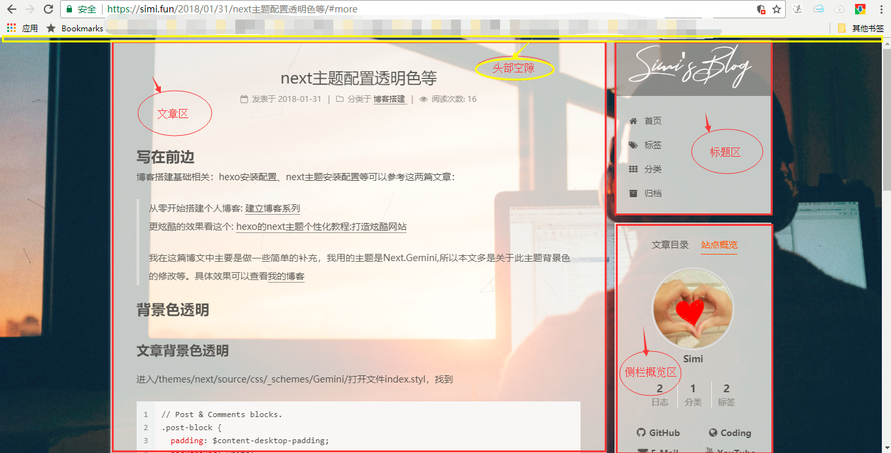
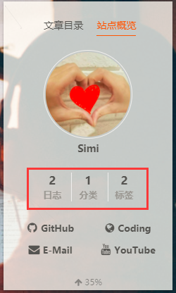
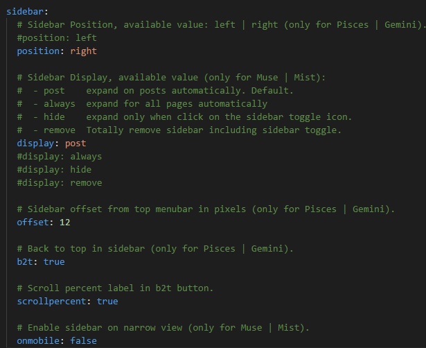

# 写在前面

博客搭建基础相关、hexo安装配置、next主题安装配置等可以参考这两篇文章：
> 从零开始搭建个人博客: [建立博客系列](http://windliang.cc/2017/01/18/%E5%BB%BA%E7%AB%8B%E5%8D%9A%E5%AE%A2%E7%B3%BB%E5%88%97%EF%BC%88%E4%B8%80%EF%BC%89%EF%BC%9A%E5%9F%9F%E5%90%8D%E7%9B%B8%E5%85%B3%E7%9F%A5%E8%AF%86/)  
更炫酷的效果看这个: [hexo的next主题个性化教程:打造炫酷网站](http://shenzekun.cn/hexo%E7%9A%84next%E4%B8%BB%E9%A2%98%E4%B8%AA%E6%80%A7%E5%8C%96%E9%85%8D%E7%BD%AE%E6%95%99%E7%A8%8B.html)

这篇博文主要对next主题配置做一些简单的补充，我用的主题是`Next.Gemini v6.0.0`版本，所以本文多是关于此主题背景色的修改等。具体效果可以查看[我的博客](https://simi.fun/)  
以下命名可能不准确，同学们可以参照我截的一张图：
其他next主题大同小异，找不到修改文件的同学可以留言。

# 背景色透明
## <span id="post-block">文章背景色透明</span>
打开文件`themes/next/source/css/_schemes/Gemini/index.styl`，找到
```css
// Post & Comments blocks.
.post-block {
  padding: $content-desktop-padding;
  background: white;
  box-shadow: $box-shadow-inner;
  border-radius: $border-radius-inner;
}
```
在其后加入一段：
```css
.post-block {
  background: rgba(255,255,255,.75) none repeat scroll !important;
}
```
Tips：这里掌握css的同学应该知道rgba的第四个参数就是改变透明度的，越接近0透明度越高，大家可以自行选择。
之后hexo g，hexo d 打开博客即可看到文章背景板已经变透明了。
## 评论区背景色透明
评论区背景色设置同上 [文章背景色透明](#post-block)，进入同一级目录，打开`index.styl`，与前面不同的是你需要找到`.comment{…}`，同样的在其后插入刚才一样的代码，注意此处插入的样式名是`comment`。
## 头部空隙设置
Next.Gemini默认的头部空隙是黑色的，它的配置代码在`themes/next/source/css/_variables/base.styl`的200多行处
```javascript
// Headband
// --------------------------------------------------
$headband-height                = 3px
$headband-bg                    = transparent
```
在这里调整头部空隙的高度和背景色，我将背景色设置成了透明。
## 标题区设置
标题背景色设置代码在`/next/source/css/_schemes/Pisces/_brand.styl`，找到
```css
.site-meta {
  padding: 20px 0;
  color: white;
  background: rgba(0,0,0,.3);

  +tablet() {
    box-shadow: 0 0 16px rgba(0,0,0,.5);
  }
  +mobile() {
    box-shadow: 0 0 16px rgba(0,0,0,.5);
  }
}
```
其中`background`即为title背景色，我这里是设置成黑色透明。

标题字体设置，在`themes/next/source/css/_custom/custom.styl`中添加如下代码：
```css
@font-face {
    font-family: simi;
    src: url('/fonts/simi.otf');
}
.site-title {
    font-size: 40px !important;
	font-family: 'simi' !important;
}
```
## 侧栏概览设置
圆形头像设置在本文开头的 [打造炫酷网站](http://shenzekun.cn/hexo%E7%9A%84next%E4%B8%BB%E9%A2%98%E4%B8%AA%E6%80%A7%E5%8C%96%E9%85%8D%E7%BD%AE%E6%95%99%E7%A8%8B.html)。

刚刚设置到这一步的同学看到的侧栏图： <div align=center>

</div>可能看到的不是这个样子，不要急，那是因为你的“分类”和“标签”都还是空的，发一篇文章打上标签并分类，之后hexo g,hexo d就能看见了。

透明背景设置，类似于[文章背景色透明](#post-block)，在`themes/next/source/css/_schemes/Pisces/_sidebar.styl`
中找到`.sidebar-inner {…}`在其后添加上面提过的透明样式代码。这里需要注意一下，有些同学在侧栏开启了"显示当前垂直位置百分比"`scrollpercent`或者"点击回到顶部"`b2t`功能之后，会出现下拉到顶部透明才产生作用的现象，此时可以尝试
> 进入`themes/next/source/css/_variables/Gemini.styl`将`$body-bg-color`设置为`transparent`(透明)。

（`scrollpercent`、`b2t`这两个功能在主题配置文件`themes/next/_config.yml`设置，如下：）<div align=center>

</div>
